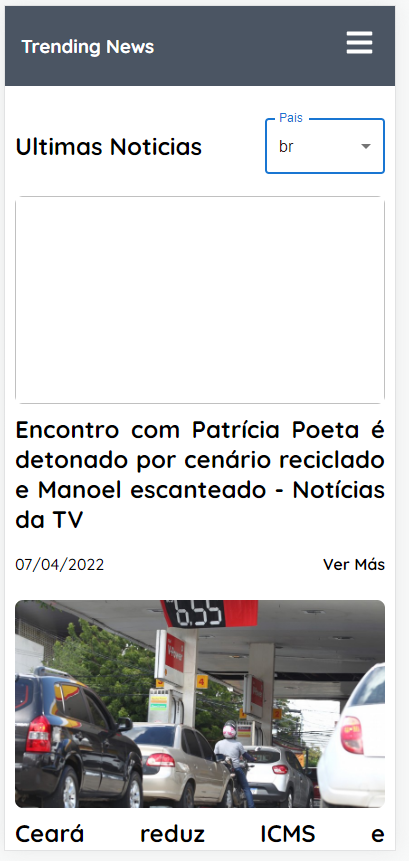
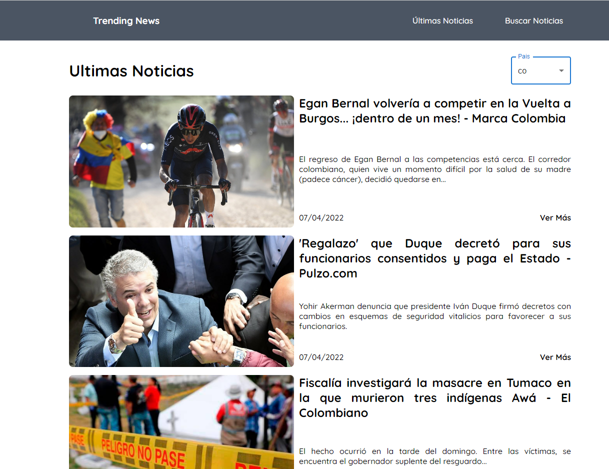

#News app de noticias

- News app utiliza NewsAPI para mostrar artículos y titulares de noticias de última hora de fuentes de noticias y blogs en toda la web

Algunas de las features que tiene son :

- implementacion de News API artículos y titulares de noticias. 
- configuracion e instalacion de webpack, babel preset, plugins y StandardJS en el proyecto.
- Maquetacion y aplicacion de estilos en las distintas secciones.
- integracion de iconos
- Implementacion de Hooks
- Implementacion de useContext
- integracion y despliegue continuo con GitHub Actions and firebase Hosting
- Implementacion de MaterialUI 

[Ver la app en producción](https://news-app-9232c.web.app/)
- Nota: para poder ver news actualizadas debemos cambiar el key 

## Scripts

## `npm install` para instalar las dependencias

## `npm run start` para correr el proyecto

## `npm format` formatea todos los archivos

## `npm lint` ejecuta el linter que nos permite encontrar errores en nuestro codigo

## Para Correr nuestro proyecto

- primero debemos bajar el proyecto:
- git clone https://github.com/aventuracode/news-app.git
- ejecutamos en consola el comando npm install para instalar las dependencias
- ejecutamos en consola el comando npm run start para correr nuestro proyecto

## Licencia

MIT
